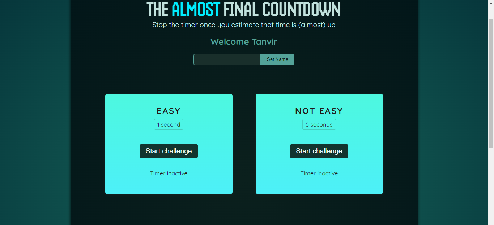
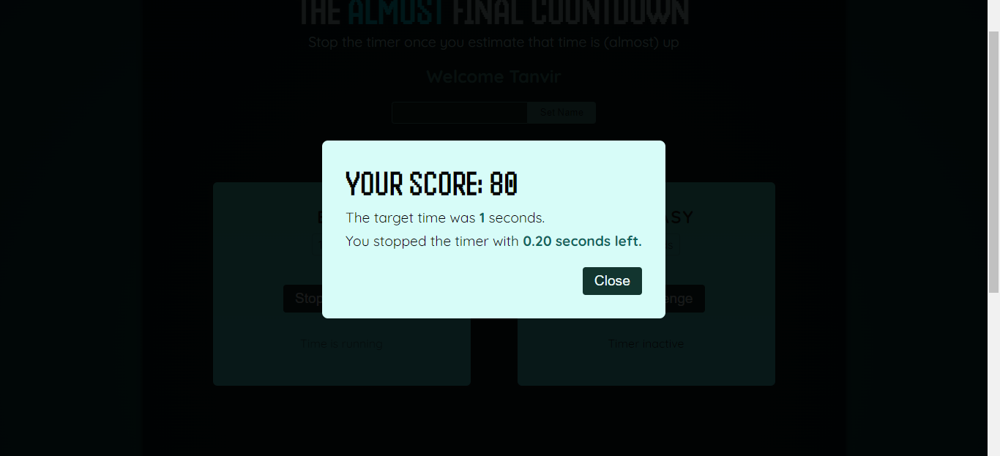

Simple React app to practice react refs.

### Screenshot of app

## Available Scripts

In the project directory, you can run:

### `npm run dev`

Runs the app in the development mode.

### `npm run build`

Builds the app for production to the `build` folder.

### `npm run preview`

Launches the test runner in the interactive watch mode.
